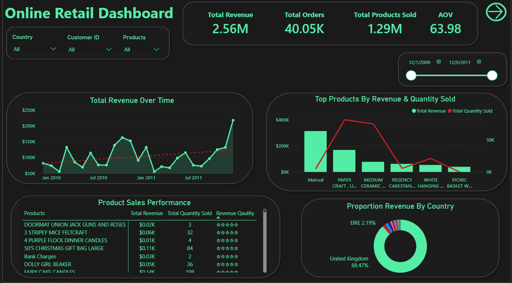

# 📌 Online Retail Dashboard

## Overview

This Power BI dashboard provides comprehensive insights into an online retail dataset spanning from December 1, 2009, to December 9, 2011. 

**Data Preparation:**
- Used **Power Query** to clean the dataset:
  - Removed invalid entries (e.g., negative prices).
  - Eliminated outliers and duplicate records.
- Built the interactive dashboard in **Power BI** for clear visualization of key performance metrics, trends, customer behavior, and product performance.

The dashboard is divided into two main views:
1. **Revenue & Product Performance**
2. **Customer & Cancellation Analysis**

## Key Metrics (Overall Period)

### Revenue & Sales
- **Total Revenue**: $2.56M
- **Total Orders**: 40.05K
- **Total Products Sold**: 1.29M
- **Average Order Value (AOV)**: $63.98

### Cancellations & Customers
- **Cancelled Revenue**: -$1.16M
- **Total Cancelled Orders**: 8.292K
- **Total Clients**: 36.96K
- **Average Basket Size**: 6.81 items

## Insights

### 1. Revenue Trends
- Revenue shows significant fluctuations but demonstrates a strong upward trajectory toward the end of 2011.
- Notable peaks around early 2010, mid-2010, and late 2011, with a sharp spike in the final months.

### 2. Top Performing Products
- **"Manual"** category dominates revenue (highest bar), though quantity sold varies.
- Other strong performers include **PAPER CRAFT LITTLE BIRDIE**, **MEDIUM CERAMIC TOP STORAGE JAR**, and **REGENCY CAKESTAND 3 TIER**.
- Products like **DOORMAT UNION JACK GUNS AND ROSES**, **3 STRIPEY MICE FELTCRAFT**, and **DOLLY GIRL BEAKER** show excellent revenue-to-quantity ratios and high customer satisfaction (5-star quality ratings).

### 3. Geographic Performance
- **United Kingdom** accounts for **88.47%** of total revenue.
- **EIRE (Ireland)** contributes **2.19%**.
- The business is heavily UK-centric, with minimal revenue from other countries.

### 4. Customer Behavior
- Top customers by order volume:
  - Customer **14911** leads significantly (~380+ orders).
  - Followed by **12748**, **17841**, **15311**, etc.
- RFM (Recency, Frequency, Monetary) Clustering reveals:
  - **Champions**: Highest monetary value ($11K+), very recent (24.93 days), and high frequency (20.11).
  - **Potential Loyalists**: Solid monetary value but lower frequency.
  - **Lost Customers**: Low frequency and monetary value, with high recency (inactive for ~384 days).

### 5. Pricing & Cancellations
- High "Average Selling Price" items include **Adjust bad debt** and **AMAZON FEE** (likely internal/adjustment entries).
- Significant cancellation rate (~20% of orders by volume), representing a major revenue leakage of $1.16M.

## Recommendations

1. **Reduce Cancellations**:
   - Investigate root causes (stock issues, pricing errors, customer experience).
   - Implement better order confirmation flows and real-time inventory visibility.
   - Target a reduction of cancelled revenue by at least 30-40%.

2. **Diversify Geographic Reach**:
   - Focus marketing and logistics efforts on expanding beyond the UK (especially EIRE and other EU markets).
   - Localize offerings and reduce shipping barriers.

3. **Leverage High-Value Customers**:
   - Create loyalty programs for **Champions** and **Loyal Customers**.
   - Re-engagement campaigns for **Lost Customers** (special offers, win-back discounts).
   - Personalized recommendations based on top products.

4. **Product Strategy**:
   - Promote and stock more of the top revenue generators (e.g., PAPER CRAFT, REGENCY items).
   - Analyze and potentially phase out or repricing low-performing SKUs.
   - Maintain high quality standards that correlate with strong sales.

5. **Data Quality & Monitoring**:
   - Continue cleaning "Adjust bad debt" and fee-related entries to avoid skewing analytics.
   - Set up automated alerts for sudden revenue drops or cancellation spikes.
   - Monitor AOV and basket size trends monthly.

6. **Growth Opportunities**:
   - Cross-sell high-margin items to increase Average Basket Size (currently 6.81).
   - Explore seasonal campaigns around peak revenue periods.

## Technical Notes
- **Tools Used**: Power Query (ETL), Power BI (Visualization).
- **Data Period**: Dec 2009 – Dec 2011.
- **Interactivity**: Filters available for Country, Customer ID, and Products.

This dashboard serves as a powerful decision-making tool for optimizing retail operations, customer retention, and revenue growth.